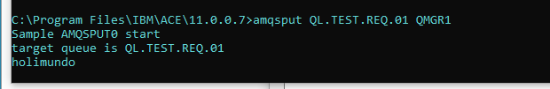

Queue Manager =>
```
  crtmqm -u QMGR1
  dspmq
  strmqm QMGR1
```
Intetration Node =>
  mqsicreatebroker BRKTEST1 -q QMGR1 -i userbus -a userbus
  //created stoped
  mqsilist
  mqsistart BRKTEST1
  mqsideletebroker BRKEST1

Execution Group =>
mqsicreateexecutiongroup BRKTEST1 -e EG_01
mqsilist

Queue Name

*QL.TEST.REQ.01*

runmqsc QMGR1
d //enter
  tooltips

  - ```DEFINE QLOCAL (QL.TEST.REQ.01)```
  - ```DEFINE QLOCAL (QL.TEST.RES.01)```

Check Local Queue List
DISPLAY QLOCAL (QL.*)
END

...

After trace creation

amqsput QL.TEST.REQ.01 QMGR1
HOLA MUNDO



